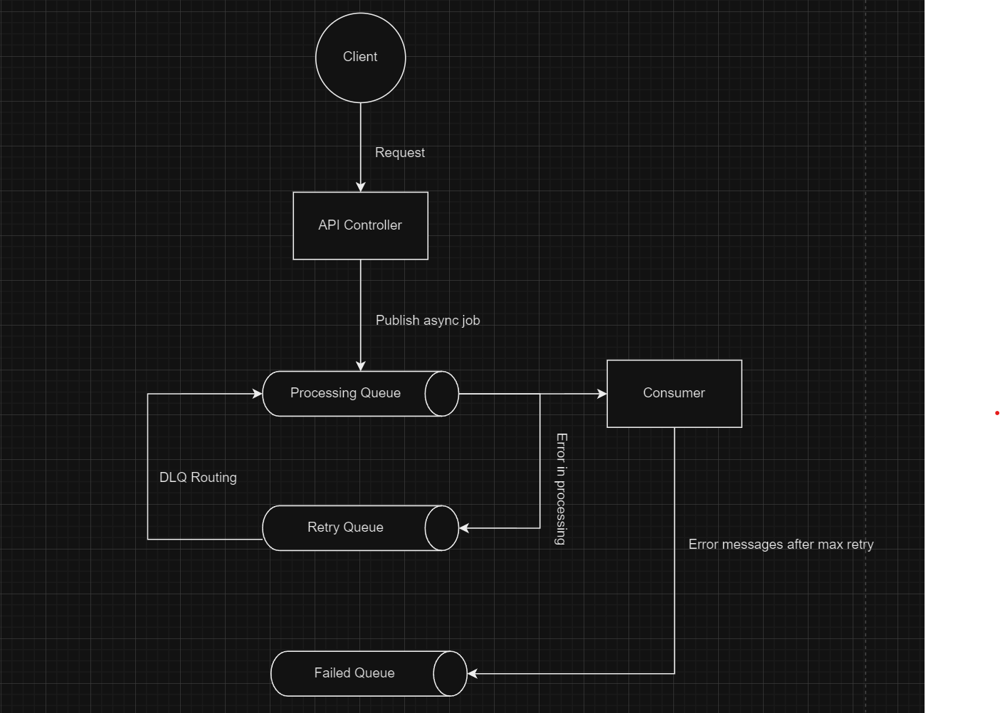

# Async Task 
Async Processor with Retry Mechanism

# System Architecture


# Setup and Compilation 
## Prerequisites
1. Maven
2. JDK 17 
3. Docker 
4. docker compose

Please make sure that the above tools are installed and configured 
properly. 

## Compilation 
cd to async-task project directory, then do the following 
1. ```git pull https://github.com/ganeshtiwari/async-task.git```
2. ```cd async-task```
3. ```docker compose up -d```  (this brings up the rabbitmq dev dependency)
4. ```mvn clean package``` 
5. ```java -jar target/async-task.jar```

## Simulation 
To run the async task scheduling and retry simulation send a post request: 
```curl -X POST http://localhost:8080/simulate```. 

This endpoint will produce a single random string message to the `processingQueue`. 
The active `processingConsumer` will consume this random string message. First the async consumer
will check whether the message retry count has exceeded the `maxRetryLimit` or not. If it has exceeded
the limit then the message is published to `failedMessageQueue` to avoid `poison mesage`. Else, we can do our business logic here. 
For simulation purpose, the code will just throw an exception. This causes the message to be rerouted to 
`retryQueue`. The retryQueue has a ttl of 3 seconds. Once ttl expires, the message is routed to the processingQueue (dead letter routing) which is 
then consumed by processingConsumer until retry limit exceeds for that particular message. 