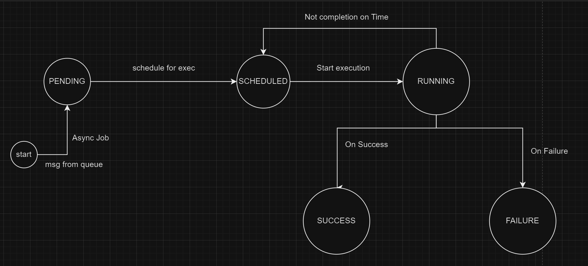

# Async Task 
Async Processor with Retry Mechanism

# Setup and Compilation 
## Prerequisites
1. Maven
2. JDK 17 
3. Docker 
4. docker compose

Please make sure that the above tools are installed and configured 
properly. 

## Compilation 
cd to async-task project directory, then do the following
```
git pull https://github.com/ganeshtiwari/async-task.git
cd async-task
docker compose up rabbitmq -d
mvn clean package
docker compose up --build -d
```

## Simulation 
To run the simulation <br />
watch logs
```docker logs async-app -f```

send post request
```curl -X POST http://localhost:8080/simulate```. 

## Execution process

This endpoint will produce 5 string messages to the `processingQueue`. 
The active `processingConsumer` will consume these string messages. 
For each message, an `AsyncJob` will be created and added to the jobs list.
These jobs will be scheduled in an async executor service. Fist the job status will be 
updated to `RUNNING` status and then the executing thread will sleep for some time. 
It then randomly tries to exit execution (for simulation of retry). If it didn't exit, the 
status will be either `SUCCESS` or `ERROR`. <br />

The watching process, running on a separate thread, periodically monitors the jobs. If the job, in the job list, 
is complete, it removes it from watch list. Else, it checks whether the job should be rescheduled or an alert should be sent 
to the admin and takes that action. 

## State Transition of Async Job


